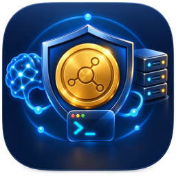

# SaveToken



SaveToken is a native macOS chat app for local language models. It connects
to Ollama on `127.0.0.1:11434` or to the optional SaveToken MLX server on
`127.0.0.1:8321`. The app contains no model weights, telemetry, advertising,
or prompt logging.

## Release status

Version 0.5.0 is a development preview for macOS 13 or later. The downloadable
app is ad-hoc signed because this project does not yet have an Apple Developer
ID certificate or notarization ticket. macOS may show an unidentified-developer
warning. The source, automated tests, release manifest, and SHA-256 checksum
are public; see the [Releases](https://github.com/kdahab2000/savetoken/releases)
page.

## Fastest setup: Ollama

1. Install and start Ollama from its official distribution.
2. Download a chat-capable model with Ollama. Embedding-only models are hidden
   from SaveToken's chat picker.
3. Open SaveToken, choose **Ollama**, press **Refresh**, and select the model.
4. Enter a message. Local model responses stream from the Ollama process on
   this Mac.

Models whose tags end in `:cloud` or `-cloud` are clearly labeled **CLOUD**. Those models may send
prompts to an Ollama remote service even though SaveToken itself connects only
to the local Ollama daemon. Choose a model without `:cloud` for local inference.

## Build from source

Requirements: macOS 13+, Xcode command-line tools, and Swift 5.9 or later.

```sh
git clone https://github.com/kdahab2000/savetoken.git
cd savetoken/FreeTokenApp

swift test --scratch-path "${TMPDIR%/}/SaveToken-build"
SCRATCH_PATH="${TMPDIR%/}/SaveToken-build" sh package_app.sh
sh tools/sign_app.sh ad-hoc
open dist/SaveToken.app
```

The build script packages only the Swift executable and icon. It does not copy
Ollama models, MLX model weights, SSH configuration, conversations, or local
settings into the app.

## Optional SSH tools

SaveToken can use named aliases from your existing `~/.ssh/config`:

- SSH is disabled for model requests by default.
- Raw hosts are rejected; only configured aliases are offered.
- Passwords and private-key contents never enter SaveToken.
- Every model-requested command pauses at a dialog showing the alias and exact
  command. Nothing runs until you approve it.
- Password-only hosts, interactive TTY programs, and hidden `sudo` prompts are
  unsupported.

For ordinary chat, leave **Allow Ollama model to request SSH** off. When it is
enabled, only prompts with clear server/SSH intent use the approval-gated tool
path; ordinary prompts keep the faster streaming path.

## Optional SaveToken MLX backend

The Python backend is intended for advanced Apple-Silicon development and
requires separately obtained MLX model weights. No weights are in this
repository or its releases. See [freetoken/README.md](freetoken/README.md).

## Privacy and boundaries

- SaveToken's HTTP client constructs loopback URLs only.
- Local Ollama and SaveToken MLX prompts stay on the Mac. Ollama cloud-tagged
  models are the explicit exception and are labeled as remote.
- SaveToken stores UI preferences in
  `~/Library/Application Support/SaveToken/settings.json`.
- Chat transcripts are not persisted by SaveToken.
- Model output and requested shell commands are untrusted; review them before
  use.

## Project layout

- `FreeTokenApp/` — SwiftUI app, tests, packaging, icon, signing helpers.
- `freetoken/` — optional localhost-only MLX backend and model manager.
- `.github/workflows/test-and-release.yml` — clean macOS build and test job.
- `SECURITY.md` — threat model and vulnerability reporting.
- `CONTRIBUTING.md` — development and artifact rules.
- `CHANGELOG.md` — release history.

SaveToken is research and development software. It is not for clinical
diagnosis or treatment.
